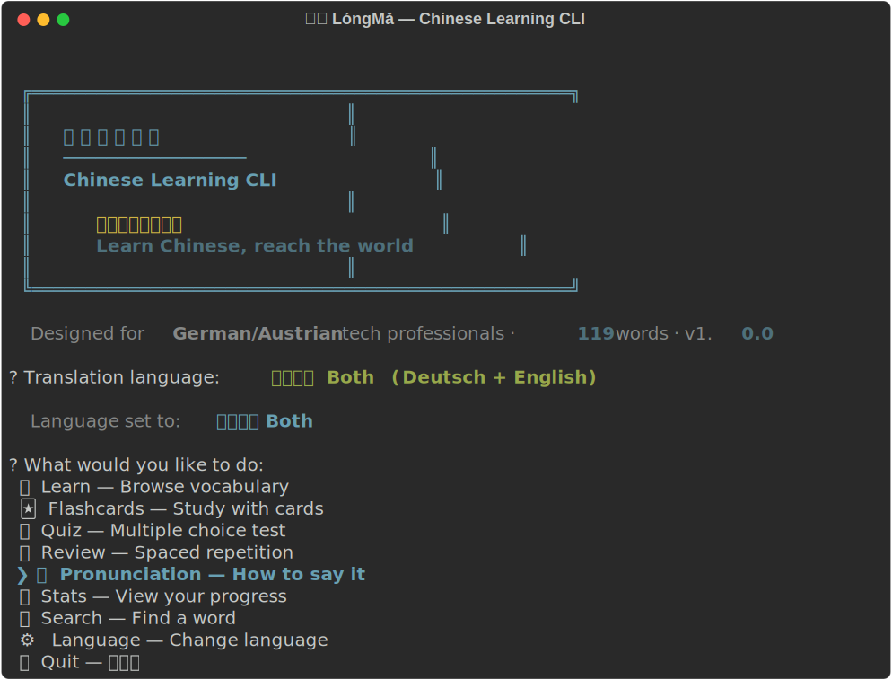
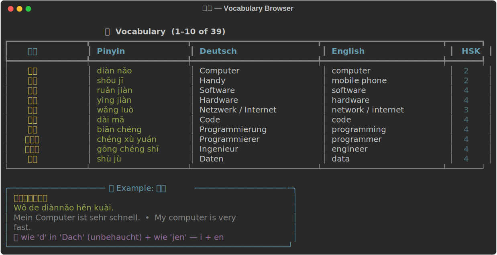
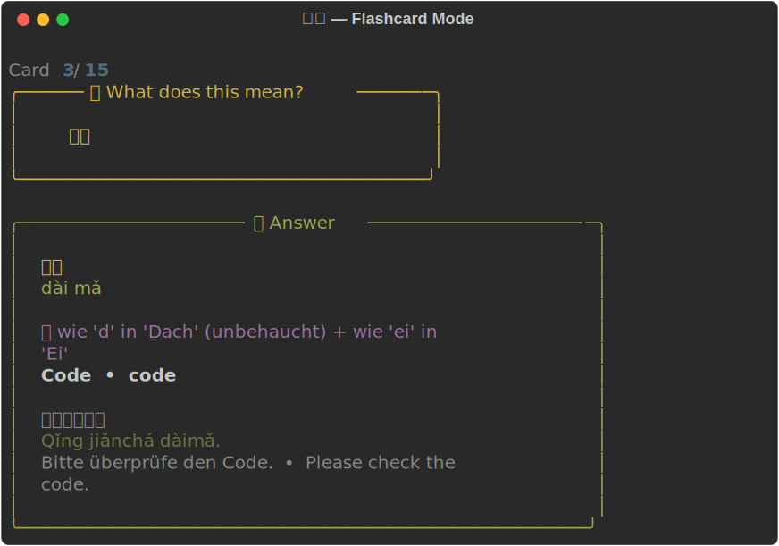
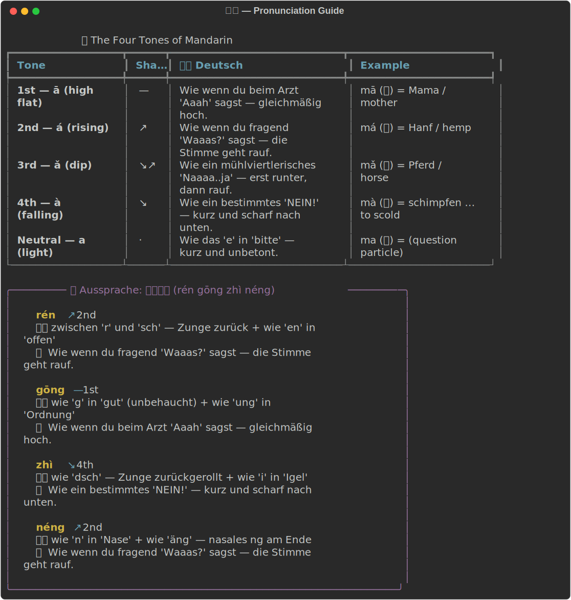
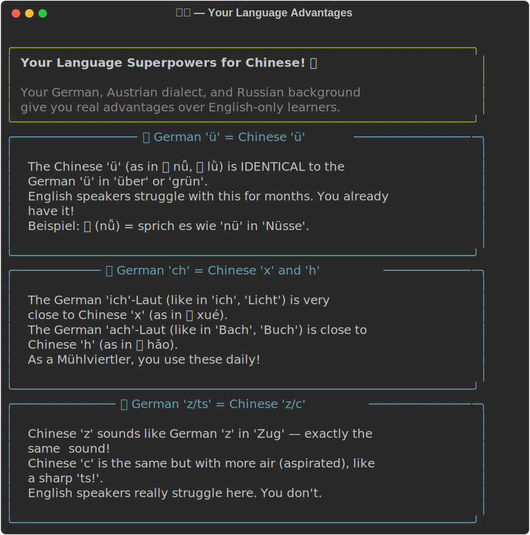
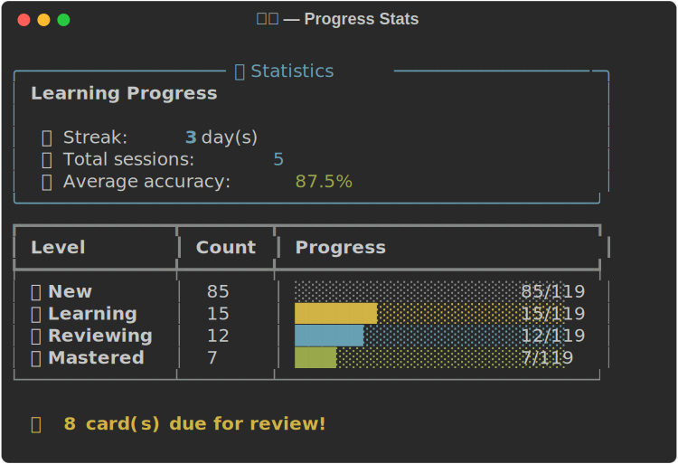
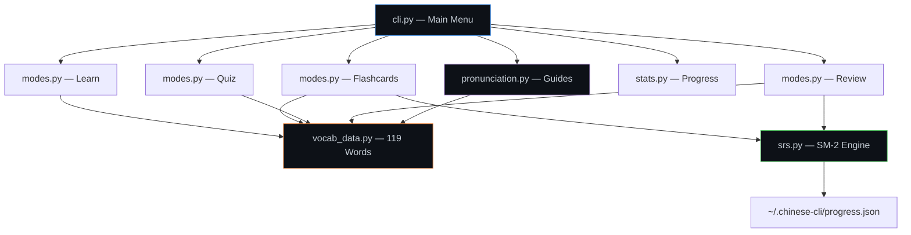

<h1 align="center">
  龙码 LóngMǎ
</h1>

<p align="center">
  <strong>Dragon Code — Learn Chinese from your terminal 🐉</strong>
</p>

<p align="center">
  
  
  
  
  
</p>

<p align="center">
  A beautiful terminal-based Mandarin Chinese learning tool,<br>
  designed for <strong>German/Austrian</strong> tech professionals with English C1.
</p>

---

## ✨ Features

| Feature | Description |
|---------|-------------|
| 📖 **Learn** | Browse 119 tech-focused vocabulary words with Hanzi, Pinyin, and translations |
| 🃏 **Flashcards** | Study with interactive cards powered by spaced repetition (SM-2) |
| 📝 **Quiz** | Multiple choice tests to challenge your knowledge |
| 🔄 **Review** | Smart review sessions — only cards due for review appear |
| 🔊 **Pronunciation** | Full Pinyin guide with German/Austrian/English approximations |
| 📈 **Stats** | Track your streak, accuracy, mastery levels, and category progress |
| 🔍 **Search** | Find any word by Hanzi, Pinyin, German, or English |
| 🇩🇪🇬🇧 **Dual Language** | Toggle between Deutsch, English, or both |
| 💪 **Language Advantages** | Tips on how your German/Austrian dialect helps with Chinese |
| 🌐 **Offline** | Fully offline — no API calls, no internet required |

---

## 📸 Screenshots

### Welcome Screen & Main Menu
<p align="center">
  
</p>

### 📖 Learn Mode — Browse Tech Vocabulary
<p align="center">
  
</p>

### 🃏 Flashcard Mode — Study with Pronunciation Hints
<p align="center">
  
</p>

### 🔊 Pronunciation Guide — Tones & Word Breakdown
<p align="center">
  
</p>

### 💪 Your Language Advantages
<p align="center">
  
</p>

### 📈 Progress Statistics
<p align="center">
  
</p>

---

## 🚀 Installation

```bash
git clone https://github.com/Artaeon/longma.git
cd longma

# Create virtual environment
python3 -m venv .venv
source .venv/bin/activate

# Install
pip install -e .
```

## 📦 Usage

```bash
# Run the CLI
chinese-cli

# Or via Python module
python -m chinese_cli
```

---

## 📚 Vocabulary Categories

| Category | Words | Focus |
|----------|-------|-------|
| 📚 **Basics** | 30 | Greetings, numbers, pronouns, essential verbs |
| 💻 **Tech** | 39 | Software, hardware, AI/ML, coding, DevOps |
| 💼 **Business** | 25 | Meetings, contracts, startups, negotiations |
| 🍜 **Daily** | 25 | Food, transport, weather, small talk |

All vocabulary entries include:
- **汉字** (Hanzi) — Chinese characters
- **拼音** (Pinyin) — Romanized pronunciation with tone marks
- **🇩🇪 Deutsch** — German translation
- **🇬🇧 English** — English translation
- **HSK Level** — Official proficiency level (1-5)
- **Example sentence** — In Chinese, Pinyin, German, and English

---

## 🔊 Pronunciation System

LóngMǎ includes a comprehensive pronunciation guide that maps every Pinyin sound to approximations in languages you already know:

### Your Superpowers 🏆

| Your Language | Chinese Sound | Why It Helps |
|---------------|---------------|--------------|
| 🇩🇪 German `ü` | Chinese `ü` | Identical! (über = nǚ) |
| 🇩🇪 German `ich`-ch | Chinese `x` | Same palatal fricative! |
| 🇩🇪 German `z` | Chinese `z` | Same [ts] sound! |
| 🇦🇹 Mühlviertlerisch | Chinese `zh/ch/sh` | Guttural sounds help with retroflexes |
| 🇷🇺 Russian `ж/ш` | Chinese `zh/sh` | Similar retroflex concept |
| 🇩🇪 German `ei/au` | Chinese `ai/ao` | Nearly identical diphthongs |

---

## 🧠 Spaced Repetition (SM-2)

LóngMǎ uses the **SM-2 algorithm** for optimal memorization:

```
Rate each card 0-5:
  0 = Complete blackout 🔴
  1 = Wrong, recognized after 🟠
  2 = Wrong, felt familiar 🟡
  3 = Correct, difficult 🟢
  4 = Correct, some hesitation 🔵
  5 = Perfect recall ⭐
```

The algorithm adjusts review intervals based on your performance — cards you struggle with appear more often, while mastered cards space out to days or weeks.

Progress is saved to `~/.chinese-cli/progress.json`.

---

## 🏗️ Architecture



---

## 🛠️ Tech Stack

- **Python 3.10+**
- [**Rich**](https://github.com/Textualize/rich) — Beautiful terminal formatting
- [**Questionary**](https://github.com/tmbo/questionary) — Interactive prompts with arrow-key navigation
- **SM-2 Algorithm** — Spaced repetition for optimal memorization
- **JSON** — Local progress persistence (no external database)

---

## 🤝 Contributing

Contributions welcome! Ideas for improvement:
- More vocabulary categories (science, finance, travel)
- Audio playback via TTS
- HSK test simulation mode
- Import/export flashcard decks
- Multi-user support

---

## 📄 License

MIT © [Artaeon](https://github.com/Artaeon)

---

<p align="center">
  <strong>学中文，走向世界</strong><br>
  <em>Learn Chinese, reach the world</em> 🌏
</p>
